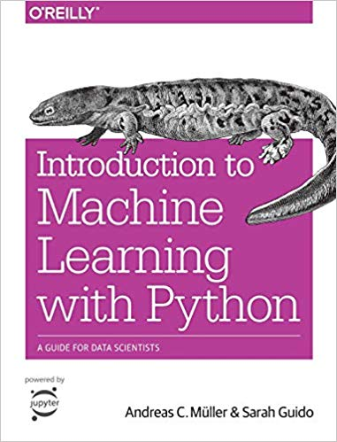

# Purpose

This repository serves the purpose of cataloging my independent experimentation into deep 

# Requirements
* pandas
* scikit-learn
* scipy
* numpy
* jupyter notebook

# Sections
* KNN
   - [Classifying Iris Species using SVMs](KNN/iris)†
       - [Notebooks](KNN/iris/notebooks)

# Resources
### _"Intro into Machine Learning with Python" by Andreas C. Müller & Sarah Guido†_
Experiments, scripts, notebooks, and analyses compiled while working through the O'Reily book 
[Intro to Machine Learning with Python](https://www.amazon.com/Introduction-Machine-Learning-Python-Scientists/dp/1449369413).

Helper code from the author can be found at the [mglearn repo](https://github.com/amueller/mglearn).

Book code base can be found from the author at the [book repo](https://github.com/amueller/introduction_to_ml_with_python).
